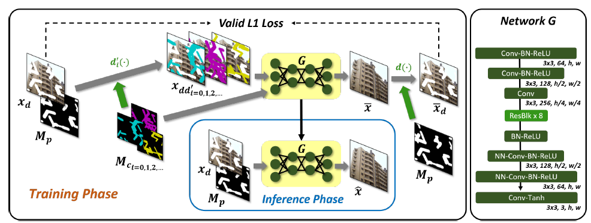
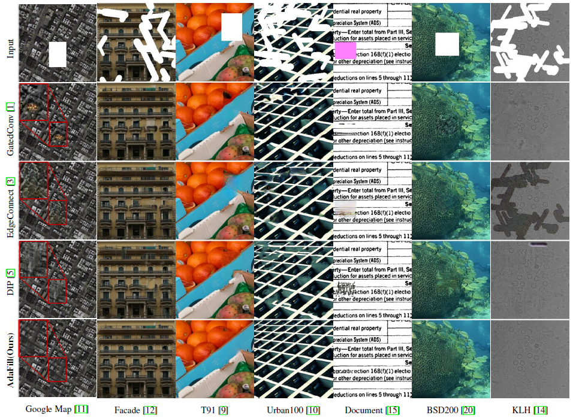

# AdaFill
AdaFill: Test-time Adaptation for Out-of-Distributed Image Inpainting official implementation.

## Abstract
Deep learning-based image inpainting algorithms have shown great performance via powerful learned prior from the numerous external natural images. 
However, they show unpleasant results on the test image whose distribution is far from the that of training images because their models are biased toward the training images.
In this paper, we propose a simple image inpainting algorithm with test-time adaptation named ***AdaFill***.
Given a single out-of-distributed test image, our goal is to complete hole region more naturally than the pre-trained inpainting models.
To achieve this goal, we treat remained valid regions of the test image as another training cues because natural images have strong internal similarities.
From this test-time adaptation, our network can exploit externally learned image priors from the pre-trained features as well as the internal prior of the test image explicitly.
Experimental results show that ***AdaFill*** outperforms other models on the various out-of-distribution test images.
Furthermore, the model named ***ZeroFill***, that are not pre-trained also sometimes outperforms the pre-trained models.


## Overall Scheme and results

Overall flow. In the training phase, we begin from the pre-trained inpainting network **G** (or random initialization for ***ZeroFill***).
Next, for test-time adaptation, we degrade a test image  with random child masks and put them into the network.
Output of the network have to be same with the test image at valid regions. After test-time training, we pass the test image with its parent mask to get the final inpainted image.
Network structure of inpainting network **G** on right.





## Prerequisites
We used following components:
- Python3.7+
- PyTorch 1.7.1
- torchvision 0.8.2
- scikit-image
- PyYAML
- PIL
- numpy
- opencv-python

## Pretrain the model
Modify 'task' option in *options.yml* file to 'Pretraining'
```
task: 'Pretraining'
```

Specify dataset location in 'dataset_dir' option in *options.yml* file
```
dataset_dir: '/home/Dataset/places365'
```

run *main.py*
```bash
python main.py
```


## AdaFill for test time adapation
First, you need to make file_list using *make_flist.py* file.
Modify following two folder directories in *make_flist.py* file
```
IMAGE_FOLDER = r'./home/Dataset/AdaFill/image'
MASK_FOLDER = r'./home/Dataset/AdaFill/mask'
```

Get *flist.txt*
```bash
python make_flist.py
```

Then modify 'task' option in *options.yml* file to 'AdaFill'
```
task: 'AdaFill'
```

You can get results.
```bash
python main.py
````
